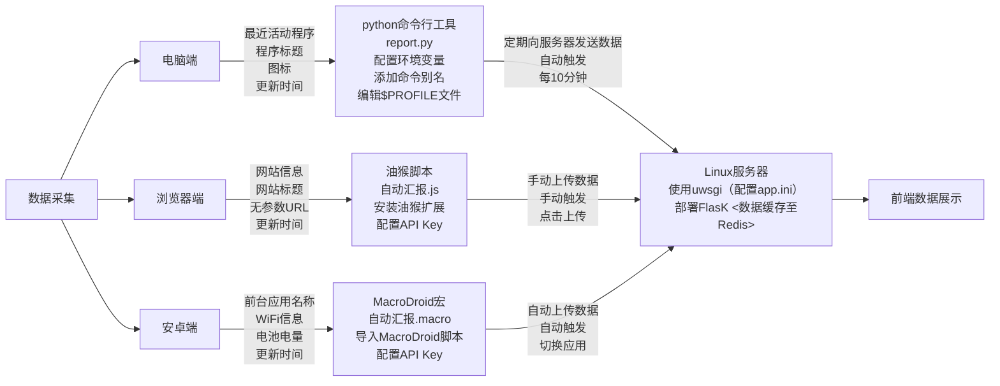

## 你在干什么?
通过网站，可以让别人知道你在干什么。
数据可以包含电脑，浏览器，手机，这几个维度。
平台|	功能	|自/手动	|触发方式
|-------|----------------------------------------|------|---------------|
电脑端	|最近活动程序、程序标题、图标、更新时间      |	自动 |	固定时间间隔（默认10分钟）
浏览器端	|网站信息、网站标题、无参数URL、更新时间     |	手动 |	点击上传按钮
安卓端	|前台应用名称、WiFi信息、电池电量、更新时间  |	自动 |	切换应用时更新


## 服务端
使用python flask服务器，mc查询使用mcstatus(安装flask,mcstatus)`pip insatll flask,mcstatus,redis`。

部署到lniux使用uwsgi `pip insatll uwsgi` app.ini 有相关配置，支持多进程,使用`uwsgi --ini app.ini`启动。
redis 保存数据，运行rediscache.py可从data.json 加载数据到redis，用于初始化数据，或迁移数据。

在config.toml 填写SECRET_KEY = "your key" 记住这个key。
redis相关配置为默认本机。Data_limit_default是默认限制条数，redis中没有相关信息时使用。
记下服务端地址(ip/域名)。

## 报告端
报告端任选，有对应报告端就有对应数据显示(都在report文件夹中)
### pc报告端

使用python脚本
report.py是一个报告命令行程序，定期向服务器发送当前正在玩儿什么，-h显示帮助
如:`python(w) report.py run -u 服务器地址 -k 'your key'`


添加命令别名和使用环境变量更加方便powershell打开个人配置文件`notepad $PROFILE`添加以下内容
```powershell
$env:REPORT_KEY="your key"
$env:REPORT_URL="服务器地址"

function get-report {
    python path\to\report.py @Args
}
function get-reportw {
    pythonw path\to\report.py @Args
}
Set-Alias -Name report -Value get-report
Set-Alias -Name reportw -Value get-reportw
```
### 浏览器端

使用油猴脚本(安装油猴扩展,谷歌扩展商店下载)
复制`自动汇报.js`内容到自定义新脚本

安装后首次弹窗输入key,api,油猴菜单查看/重置信息

启用后右上角会有上传按钮,编辑确认好(当心url中的敏感信息,?参数默认全部去除)上传,在油猴中管理排除的网站

### 安卓端

使用MacroDroid,导入`自动汇报.macro`到软件,修改 动作>http请求>请求头参数中的API-KEY的值为your key


