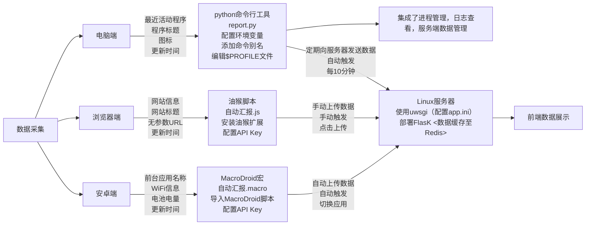

## 你在干什么?
通过网站，可以让别人知道你在干什么。
数据可以包含电脑，浏览器，手机，这几个维度。
平台|	功能	|自/手动	|触发方式
|-------|----------------------------------------|------|---------------|
电脑端	|最近活动程序、程序标题、图标、更新时间      |	自动 |	固定时间间隔（默认10分钟）
浏览器端	|网站信息、网站标题、无参数URL、更新时间     |	手动 |	点击上传按钮
安卓端	|前台应用名称、WiFi信息、电池电量、更新时间  |	自动 |	切换应用时更新


## 服务端

```bash
cd server
pip install -r requirement.txt
```

在config.toml 填写SECRET_KEY = "your key"。

可选数据保存方式
> (默认)redis 保存数据,支持多进程。

> json 保存数据，多进程不安全，配置文件设置without_redis = true启用
> 使用uwsgi时注意设置processes=1。
>
redis配置默认本机。Data_limit_default是默认限制条数只在初始化时使用。

部署到Linux使用uwsgi `pip insatll uwsgi` app.ini 有相关配置，使用`uwsgi --ini app.ini`启动。

## 报告端
报告端任选，有对应报告端就有对应数据显示(都在report文件夹中)
### pc报告端
> [!NOTE]
> 现在可以下载无需环境的win-64 zip版本
> https://github.com/2412322029/seeme/releases/latest

 :+1: 附带应用时间统计功能

或者使用python脚本
report.py是一个报告命令行程序，定期向服务器发送当前正在玩儿什么，-h显示帮助
如:`python(w) report.py run -u 服务器地址 -k 'your key'`

report_gui.py 是上面的gui包装，附带其他功能。
打包后无命令行参数启动自身，否则启动report.py，不带终端窗口，没有输出，在后台运行
```bash
> report -h                                    
usage: report.py [-h] {log,status,kill,pause,resume,run,getlimit,getinfo,delinfo,setlimit} ...

定时报告程序，可以从环境变量中获取 REPORT_KEY 和 REPORT_URL

positional arguments:
  {log,status,kill,pause,resume,run,getlimit,getinfo,delinfo,setlimit}
                        可用的命令
    log                 查看最新日志
    status              查询进程状态
    kill                杀死进程
    pause               暂停进程
    resume              恢复进程
    run                 运行定时报告程序(使用pythonw可在后台运行)
    getlimit            获取服务器限制值
    getinfo             获取服务器数据
    delinfo             删除服务器数据
    setlimit            设置服务器数据最大个数

options:
  -h, --help            show this help message and exit
```


### 浏览器端

使用油猴脚本(安装油猴扩展,谷歌扩展商店下载)
复制`自动汇报.js`内容到自定义新脚本

安装后首次弹窗输入key,api,油猴菜单查看/重置信息

启用后右上角会有上传按钮,编辑确认好(当心url中的敏感信息,?参数默认全部去除)上传,在油猴中管理排除的网站

### 安卓端

使用MacroDroid,导入`自动汇报.macro`到软件,修改 动作>http请求>请求头参数中的API-KEY的值为your key


### TODO
- 显示steam在线情况（完成）
- report命令行->gui（已完成部分功能,打包后、后台report部分运行占用内存变大）
- 应用时间统计（已完成基本功能）
- 定时上传统计数据库（未完成）
- 服务端应用时间统计接口（未完成）
- 前端表格统计（未完成）

前端源码https://github.com/2412322029/seeme-frontend
### 打包指南

pip install nuitka
进入report目录，使用powershell运行build.ps1


